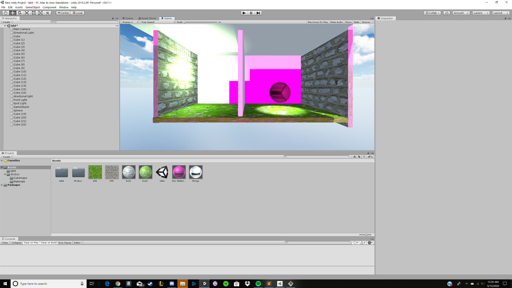
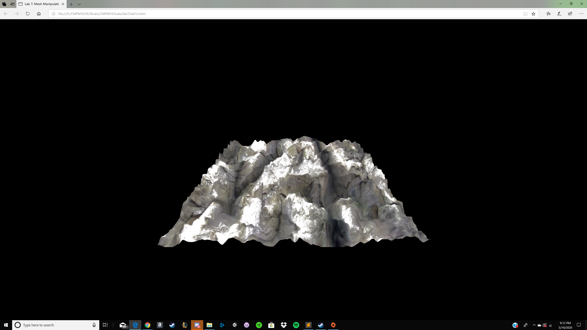

Lab 2: 
https://drive.google.com/file/d/1A2nE-gSfzowBx03oC5c0xbMBhySA283Q/view?usp=sharing 

  
Lab3:
 
https://drive.google.com/file/d/1RnCMnIGK5Ih-fZBJbjqcyPG3JEhDUBJ-/view?usp=sharing
 
Cubes from left to right: 
1:Standard cube with shader with interpolating colors 
2:Interpolating between red and yellow and x axis 
3:Standard cube with phong material 
4:cube with distance material, was not able to change color for some reason 

Lab4: 
https://drive.google.com/file/d/1MvNTZ3Jo13ss9wm5LuRKReFZbVrpjb6K/view?usp=sharing 
24 
	a: x = 8(width of texture) * U 
	b: y = 8(height of texture) - v * 8(height of texture) 
	c: White Grid 
	 
Cubes Left to Right 
Cube1: Use texture and map #196, followed doc instructions 
Cube2: Use original material of Cube1 
Cube3: Use texture and map #176 by following doc instructions 
Cube4: Used shader to make texture instead of THREE.js. Used #165 
Cube5: Same steps as Cube4 with #177. To complete the challenge I did modulo funciton by 0.5 in fragmentshader2.frag.
 
 
Lab5:  
part 1 : https://drive.google.com/file/d/16qijW4XJTWDFtw5_HrXlFQc3BkvMPRqg/view?usp=sharing
 
particle explosion: https://drive.google.com/file/d/1_RuNcEp3ffrZNq8mAeS04aZqW4_dXXiF/view?usp=sharing
 
My Creation: https://drive.google.com/file/d/1cv06hCT-iMMupGdg_RZmz8BDK5_Qs8qZ/view?usp=sharing
 
I used what we learned in part a and b and attempted to create snowflakes falling down fast to create a snowstorm. 
 
 
Lab 6 Part 1:
 

 

 
I tried to make a material similar to the smoothie I had. I played around with the Albedo and color to replicate the inside of my drink. The material is on the sphere in the scene.
 Spotlight:Light shines in a single direction and is affected by position and rotation
 Area Light: Emits light from a side of a plane and only works when baked in a lightmap.
 Point Light: Light shines in all directions. Is not affected by rotation but position is malleable.
 Directional Light: Light shines in a single direction and is like the sun. Affects all objects. Direction is changed through rotation.
 
 
Skybox: I  downloaded an asset from unity and added the material to the skybox. It looks like the daytime.
 
Textures: I used the brick texture for the walls and a grassy bush texture for the floor.
 
 
Lab7:
  Part A:
  
  
>br> Part B:
https://drive.google.com/file/d/1mzyDgu2RpM_aDjM8leIF8Mkei9IoqYII/view?usp=sharing
