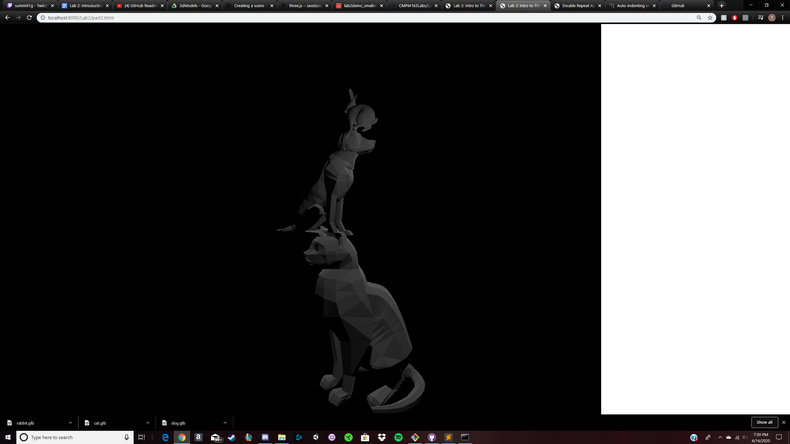

Lab 2:
https://drive.google.com/file/d/1A2nE-gSfzowBx03oC5c0xbMBhySA283Q/view?usp=sharing

Lab3:
https://drive.google.com/file/d/1RnCMnIGK5Ih-fZBJbjqcyPG3JEhDUBJ-/view?usp=sharing
Cubes from left to right:
1:Standard cube with shader with interpolating colors
2:Interpolating between red and yellow and x axis
3:Standard cube with phong material
4:cube with distance material, was not able to change color for some reason

Lab4:
24
	a: x = 8(width of texture) * U
	b: y = 8(height of texture) - v * 8(height of texture)
	c: White Grid
	
Cube1: Use texture and map #196
Cube2: Use original material of Cube1
Cube3: Use texture and map #176
Cube4: Used shader to make texture instead of THREE.js. Used #165
Cube5: 